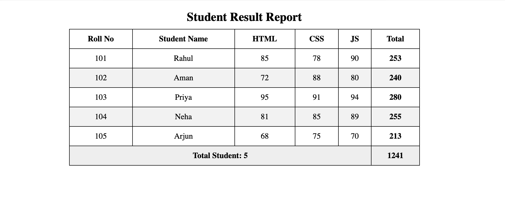
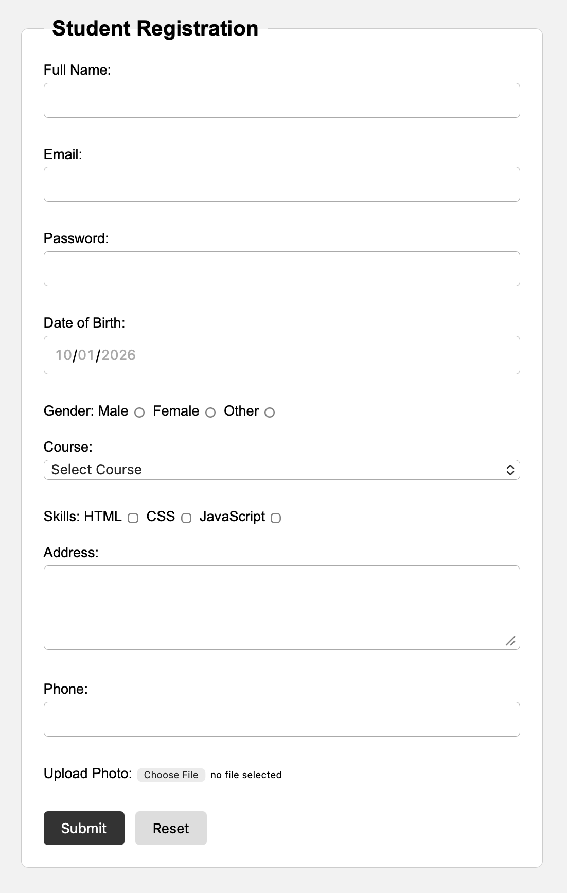

# HTML Learning Projects

This repository was created to learn and practice HTML by building simple web pages and experimenting with different HTML elements.

## About this repo

I made this project to improve my understanding of:

- HTML structure
- headings, paragraphs, and sections
- images and links
- ordered and unordered lists
- semantic tags like `header`, `main`, and `section`
- basic web page layout

## Projects included

- `project 1/1.html` - a personal profile page with introduction, profile image, hobbies, and links
- `project 2/htmlLearning.html` - HTML learning practice file
- `project 3/WhatisHTML.html` - an introduction to what HTML is and why it is used
- `project 3/HTMLDocumentStructure.html` - a lesson on the basic structure of an HTML document
- `project 3/Headings.html` - a lesson on heading levels from `h1` to `h6` and how to use them properly
- `project 3/Paragraphs_TextFormatting&comment.html` - a lesson on paragraphs, inline text formatting, and HTML comments
- `project 3/BasicAttributes.html` - examples of common HTML attributes such as `title`, `id`, `class`, `href`, and `src`
- `project 3/image.html` - examples of embedding images in HTML
- `project 3/link.html` - examples of links, anchors, and email links
- `project 3/list.html` - examples of ordered, unordered, and nested lists
- `project 3/CompleteExample.html` - a simple complete HTML page that combines several elements together
- `project 3/assets/` - supporting assets used in the HTML lessons
- `project 4/Forms.html` - a lesson on HTML form structure, inputs, buttons, and form methods
- `project 4/InputTypes.html` - examples of all the common HTML input types and their use cases
- `project 4/table.html` - a lesson covering table elements, rows, headers, spans, captions, and table layout
- `project 4/LabelsAndPlaceholders.html` - examples showing how labels and placeholders improve form usability
- `project 4/Entities.html` - examples of HTML special characters using entities like `&lt;`, `&amp;`, and `&copy;`
- `project 4/SemanticTags.html` - examples of semantic tags such as `header`, `main`, `nav`, `article`, `aside`, and `footer`
- `project 4/divAndSpan.html` - a lesson comparing block-level `div` and inline `span` elements
- `project 4/filePathAndFolderStructure.html` - examples of relative paths and understanding project folder organization
- `project 4/iframe.html` - examples of embedding another webpage inside the current page using `iframe`

## Side project: implement_Learning

The folder `implement_Learning` is my personal practice folder where I build small projects to apply the HTML lessons I have learned.

### Project: studentResultTable

- `implement_Learning/studentResultTable/studentResultTable.html` - a student result table project created to practice table structure, `colspan`, headings, and layout styling
- `implement_Learning/studentResultTable/Result.png` - screenshot of the completed result table page

The CSS for this project was written with the help of ChatGPT to improve the table design, spacing, colors, and hover effects while keeping the HTML structure clean and educational.

### Project: registrationForm

- `implement_Learning/registrationForm/registrationFrom.html` - a student registration form with text, email, password, date, radio, select, checkbox, textarea, telephone, and file inputs
- `implement_Learning/registrationForm/result.png` - screenshot of the completed registration form

### Project: Multi-PageHotelBookingWebsite

- [Home page](implement_Learning/Multi-PageHotelBookingWebsite/index.html) with hotel information, facilities, featured rooms, images, and guest testimonials
- [Rooms page](implement_Learning/Multi-PageHotelBookingWebsite/rooms.html) with a room comparison table, rates, facilities, and booking links
- [Booking page](implement_Learning/Multi-PageHotelBookingWebsite/booking.html) with a labeled booking form and grouped controls
- [About page](implement_Learning/Multi-PageHotelBookingWebsite/about.html) practicing semantic text, lists, quotations, and figures
- [Contact page](implement_Learning/Multi-PageHotelBookingWebsite/contact.html) with contact links, a message form, and an embedded map

## Purpose

This repo is a beginner learning project focused on:

- building simple static web pages
- understanding how HTML works
- practicing Git and GitHub workflow
- committing changes and pushing them online

## How to view the project

Open any `.html` file in a browser to see the page.

## Git learning

This repository is also used to practice:

- creating files and folders
- staging changes with Git
- writing meaningful commit messages
- pushing code to GitHub

## Notes

This is a personal learning repository, and it is meant to track progress while learning HTML and Git basics.
